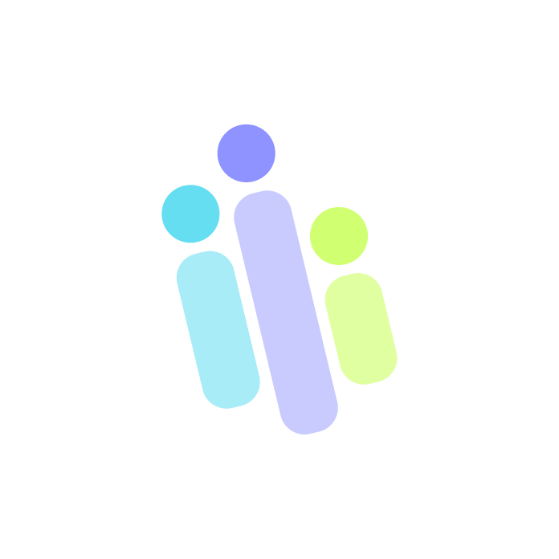

# Rihla MCP

The Rihla plugin marketplace by Sadaa, for Claude and Codex.

Connects to **https://mcp-dev.sadaa.com/mcp** using Streamable HTTP and OAuth (scope `rihla`). This repository packages client configuration and branding; the MCP server runs remotely. The configured endpoint is the development environment.

## Claude Cowork / Claude Desktop

1. Open **Customize → Plugins → + → Add marketplace**.
2. Choose **Add from a repository** and enter `https://github.com/sadaacx/rihla-mcp`.
3. Install **rihla** from the **sadaacx** marketplace.
4. Connect Rihla and complete OAuth with your own account. Enable it for your conversation if needed.

Organization policies may require an administrator to enable the plugin or connector.

Alternatively, add `https://mcp-dev.sadaa.com/mcp` directly under **Customize → Connectors → Add custom connector**, then connect.

## Claude Code

```text
/plugin marketplace add sadaacx/rihla-mcp
/plugin install rihla@sadaacx
```

Use `/mcp` to authenticate Rihla. Reload plugins or restart Claude Code if requested.

## Codex

```bash
codex plugin marketplace add https://github.com/sadaacx/rihla-mcp.git
codex plugin add rihla@sadaacx
```

Complete OAuth in the app. For CLI authentication, use `codex mcp list` to find the installed server name, then run `codex mcp login <server-name> --scopes rihla`. Start a new task to load the tools.

## Authentication and branding

Each person signs in independently. No credentials or tokens are included. The logo is bundled locally and configured for Codex; Claude controls its own icon display.

## Maintainers

The Claude catalog is `.claude-plugin/marketplace.json`; the Codex catalog is `.agents/plugins/marketplace.json`. The shared plugin lives in `plugins/rihla/`.

Update both plugin manifest versions together when publishing changes. Change the endpoint in `plugins/rihla/.mcp.json`. Never commit credentials, tokens, or personal configuration.
